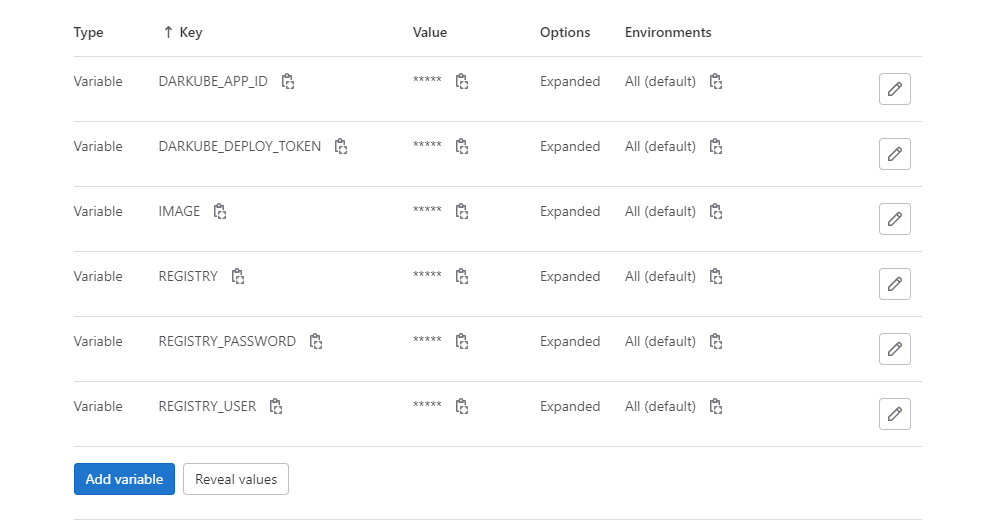

<div align="center">

<h1 align="center">Django3.2 Hamravesh Template</h1>
<h3 align="center">Sample Project to use hamravesh service provider for django app</h3>
</div>
<p align="center">
<a href="https://www.python.org" target="_blank">  </a>
<a href="https://www.djangoproject.com/" target="_blank">  </a> 
<a href="https://www.docker.com/" target="_blank">  </a>
<a href="https://www.postgresql.org" target="_blank">  </a>
<a href="https://www.nginx.com" target="_blank">  </a>
<a href="https://git-scm.com/" target="_blank">  </a>
<a href="https://hamravesh.com/" target="_blank">  </a>
</p>

# Guideline
- [Guideline](#guideline)
- [Goal](#goal)
- [Development usage](#development-usage)
  - [Clone the repo](#clone-the-repo)
  - [Enviroment Varibales](#enviroment-varibales)
  - [Build everything](#build-everything)
  - [Note](#note)
  - [Check it out in a browser](#check-it-out-in-a-browser)
- [Testing Usage](#testing-usage)
  - [running all tests](#running-all-tests)
- [Hamravesh deployment](#hamravesh-deployment)
  - [0- Create and account](#0--create-and-account)
  - [1- Create a repo app](#1--create-a-repo-app)
  - [2 - Setup database](#2---setup-database)
  - [3 - Setup django app](#3---setup-django-app)
    - [1- General info (اطلاعات عمومی)](#1--general-info-اطلاعات-عمومی)
    - [2- Environment Variables](#2--environment-variables)
    - [3- Domain Address](#3--domain-address)
    - [3 - Pick a plan](#3---pick-a-plan)
    - [4 - wait until its deployed](#4---wait-until-its-deployed)
  - [3 CICD Deployment](#3-cicd-deployment)
    - [Github CICD](#github-cicd)
    - [Gitlab/Hamgit CICD](#gitlabhamgit-cicd)
- [License](#license)
- [Bugs](#bugs)

# Goal
This project main goal is to provide a simple way to deploy a django project into hamravesh service provider.

# Development usage
You'll need to have [Docker installed](https://docs.docker.com/get-docker/).
It's available on Windows, macOS and most distros of Linux. 

If you're using Windows, it will be expected that you're following along inside
of [WSL or WSL
2](https://nickjanetakis.com/blog/a-linux-dev-environment-on-windows-with-wsl-2-docker-desktop-and-more).

That's because we're going to be running shell commands. You can always modify
these commands for PowerShell if you want.


## Clone the repo
Clone this repo anywhere you want and move into the directory:
```sh
git clone https://github.com/AliBigdeli/Django-Hamravesh-Docker-Template.git
```

## Enviroment Varibales
enviroment varibales are included in docker-compose.yml file for debugging mode and you are free to change commands inside:

```docker
services:
  backend:
    command: sh -c "python manage.py check_database && \ 
                    yes | python manage.py makemigrations  && \
                    yes | python manage.py migrate  && \
                    python manage.py runserver 0.0.0.0:8000"
    environment:      
      - DEBUG=True
```

## Build everything

*The first time you run this it's going to take 5-10 minutes depending on your
internet connection speed and computer's hardware specs. That's because it's
going to download a few Docker images and build the Python + requirements dependencies.*

```sh
docker compose up --build
```

Now that everything is built and running we can treat it like any other Django
app.

## Note

If you receive an error about a port being in use? Chances are it's because
something on your machine is already running on port 8000. then you have to change the docker-compose.yml file according to your needs.
## Check it out in a browser

Visit <http://localhost:8000> in your favorite browser.

# Testing Usage
## running all tests
```sh
docker compose run --rm backend sh -c " black -l 79 && flake8 && python manage.py test" -v core:/app
```
or
```sh
docker compose exec backend sh -c sh -c " black -l 79 && flake8 && python manage.py test" 
```

# Hamravesh deployment

## 0- Create and account
in order to deploy your project inside hamravesh first you need to create an account. so please go to the following url and create your account.

<https://console.hamravesh.com/signup>

after that you need to sign in to your console panel. which is going to be like this.
<div align="center" ></div>

## 1- Create a repo app
in order to deploy your project you can use repo mode (or منبع گیت) after clicking on the item. you will see a panel like this below:

<div align="center" ></div>

as you can see you have to provide your github/gitlab/hamgit repo address for deployment. 
in our case the configuration will be as follow:

``` properties
repo_address: https://github.com/AliBigdeli/Django-Hamravesh-Docker-Template.git
# if you are just testing without cicd use main or if you want to use cicd script to delpoy create a prod branch and then add it here
branch_name: main
build_context: .
docker_file_address: ./dockerfiles/prod/django/Dockerfile
```
Note: as we are going to implement ci/cd and other stuffs we avoid auto deployment or even uploading file.

after your done with the inputs just click on (تنظیمات اپ) and go for next step.

## 2 - Setup database
follow the provided steps to finish this section.


surely you are going to need a postgres database for your deployment so all you have to do is to create a postgres app first.
in the app section click on the PostgreSQL database.

<div align="center" ></div>

then in the next window pick a name for the database service name.

<div align="center" ></div>

Note: in our case we dont need to access the database through the internet.

after that just choose a plan for it and create the database instance.
<div align="center" ></div>

now that your database is created you can use it for connecting other apps to it.
<div align="center" ></div>

the provided database credentials and url are as follows:
``` properties
db_address: my-site-postgre.bigdeliali3.svc:5432
db_username: postgres
db_password: ddGrZM7u3BsduXm5ph3WzPYlMWSMTXbu
```
Note: if you dont want to use the default database by the name of postgres,
you just have to head to the terminal tab and create a another database for your project you can call it anything you want.

<div align="center" ></div>

```shell
psql -U postgres -c "create database <db_name>"
```


## 3 - Setup django app
follow the provided steps to finish this section.

### 1- General info (اطلاعات عمومی)
<div align="center" ></div>

in this page you have to provide general information's about the app you are about to create, which in my case are as follows:

``` properties
app_name: my-site # name of the app which is going to be called inside the portal
service_port: 8000 # which is based on the gunicorn port
execute_command: gunicorn --bind 0.0.0.0:8000 core.wsgi:application
```
Note: provided information is just enough to run our program for more details please visit this url 
<https://docs.hamravesh.com/darkube/create/git-repo/settings/general/>

### 2- Environment Variables
<div align="center" ></div>

in this section you have to provide the environment variables which are going to be used in the project. you can switch to editor and pase our template that is placed in /envs/prod/.env.sample

Note: provided information is just enough to run our program for more details please visit this url <https://docs.hamravesh.com/darkube/create/git-repo/settings/envs/>

### 3- Domain Address
<div align="center" ></div>

pick a name for you app which is going to be accessed through the web and for better security please enable https redirect.
keep in mind that you can give a different dns name through a provider like arvan or cloudflare.(we will provide more details for this matter later)

Note: provided information is just enough to run our program for more details please visit this url <https://docs.hamravesh.com/darkube/create/git-repo/settings/domain-address/>


### 3 - Pick a plan 
<div align="center" ></div>

for launching purposes you have to pick a plan for resources. based on the scale and traffic of your project you have to pick one.

Note: at the moment we are not using disks and we are just using the static files being served by the Whitenoise.

### 4 - wait until its deployed
<div align="center" ></div>

now all you have to do is to wait util the project is fully deployed.

after its done you can access the website through the url you picked in stage 3 of the setup.


## 3 CICD Deployment
For the sake of continuous integration and deployment i have provided two samples for github and gitlab/hamgit for you.
but there will be some configurations to be added for building and deploying purposes.

### Github CICD
will be provided soon

### Gitlab/Hamgit CICD
in order to do ci/cd in the sample project for gitlab/hamgit you have to create a duplicate of the ```.gitlab-ci.yml.sample``` but with different name as ```.gitlab-ci.yml``` in the root directory.

after that our pipeline will be always listening to the prod branch. if you commit in this branch it will go through the process.


note that you have to declare 5 or more environment variables in your gitlab/hamgit project repo, which you can add it by going to ```Settings>CI/CD>Variables```, and in this section try to add all the needed variables.

<div align="center" ></div>

these variables should be included:
- DARKUBE_APP_ID - ``` which can be found in app info page ```
- DARKUBE_DEPLOY_TOKEN - ``` which can be found in app info page ```
- IMAGE -  ``` registry.hamdocker.ir/<USERNAME>/<APPNAME> ```
- REGISTERY - ``` registry.hamdocker.ir/<USERNAME> ```
- REGISTERY_PASSWORD - ``` registry password ```
- REGISTERY_USER - ``` username like 'bigdeliali3' ```


for having ```DARKUBE_APP_ID``` and ```DARKUB_DEPLOY_TOKEN``` head to the app page and use the following parameters in the picture.

<div align="center" ></div>

for having ```REGISTRY``` and ```REGISTRY_USER``` and ```REGISTRY_PASSWORD``` head to the app page and use the following parameters in the picture.
REGISTRY will be the url like this: ```registry.hamdocker.ir/<USERNAME>```
and for getting the username and passwords just go to the app section and click on docker image. you will see something like this, after that click on registries.
<div align="center" ></div>

On top of the page you can find the credentials for registry that you need.
<div align="center" ></div>

after that if everything goes well you can see that the jobs are working.
# License
MIT.


# Bugs
Feel free to let me know if something needs to be fixed. or even any features seems to be needed in this repo.
